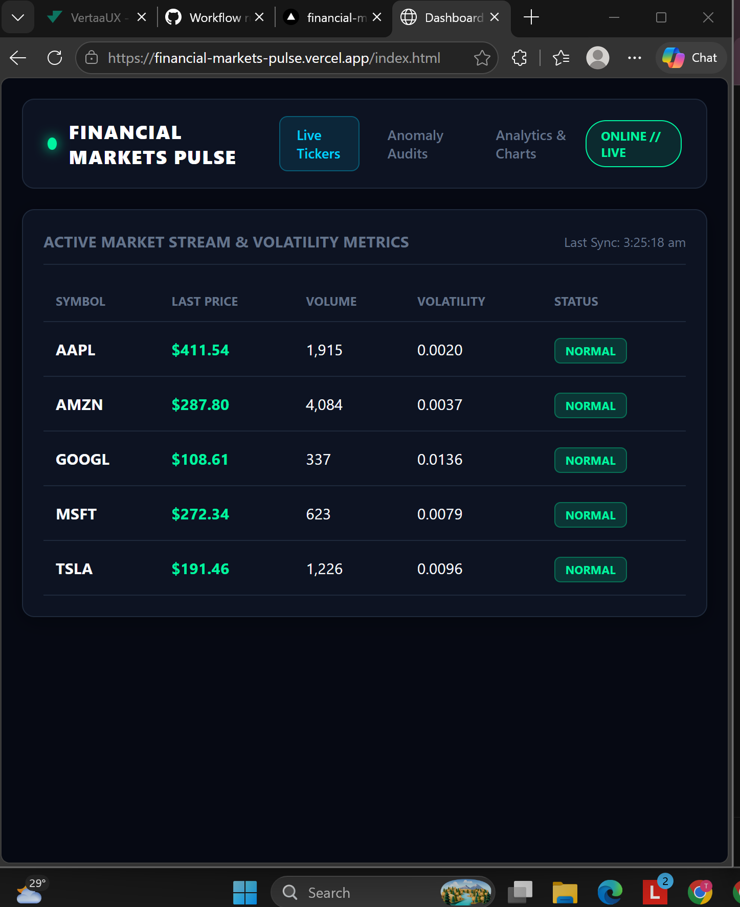
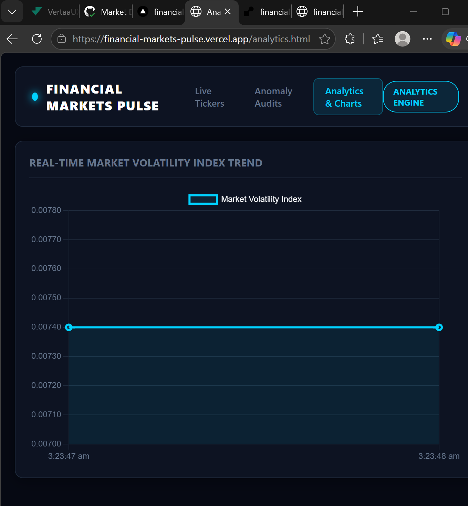
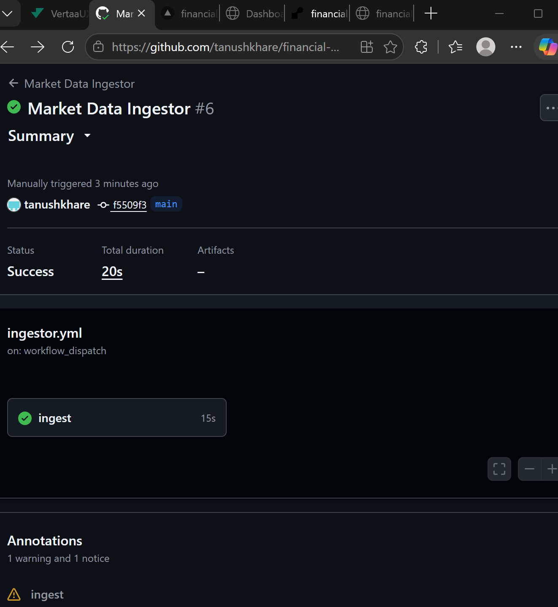

# 📈 Financial Markets Pulse

<div align="center">

[](https://financial-markets-pulse.vercel.app/index.html)
[](https://financial-markets-pulse-api-v2.onrender.com/docs)
[](LICENSE)

</div>

A real-time financial market data streaming, anomaly detection, and analytics platform built with a modern decoupled architecture. It tracks live market tickers, performs automated anomaly audits, provides advanced analytics and charts, and exposes both REST and GraphQL APIs.

* **Live Web Application:** [https://financial-markets-pulse.vercel.app/index.html](https://financial-markets-pulse.vercel.app/index.html)
* **Backend API Documentation (Swagger / OpenAPI):** [https://financial-markets-pulse-api-v2.onrender.com/docs](https://financial-markets-pulse-api-v2.onrender.com/docs)

---

## 📸 Dashboard Preview



## 📸 Analytics and Volatility Trend


## 📸 GitHub Actions Ingestor Success


## 🚀 Key Features

* **Live Market Tickers:** Real-time polling and streaming of stock quotes (AAPL, AMZN, GOOGL, MSFT, TSLA) with automated last-sync time tracking.
* **Anomaly Audits:** Automated detection and logging of unusual volume spikes or price volatility.
* **Analytics & Charts:** Interactive visual data representations of market trends.
* **Dual API Layer:** Built-in support for both high-performance REST endpoints and GraphQL queries.
* **Automated Data Ingestion:** Background data pipeline using automated scripts and database integrations.

---

## 🛠️ Tech Stack

* **Frontend:** HTML5, CSS3, JavaScript (hosted on **Vercel**)
* **Backend:** Python, **FastAPI**, Uvicorn (hosted on **Render**)
* **Database:** PostgreSQL / Supabase
* **Automation / Ingestor:** Python-based simulation script integrated with database drivers

---

## 📂 Project Structure

```text
financial-markets-pulse/
│
├── frontend/                  # Frontend web app UI files (HTML, CSS, JS, config)
│   ├── generate-a-professional-financial-m/
│   │   ├── index.html
│   │   ├── anomalies.html
│   │   └── analytics.html
│   └── config.js              # Global production endpoints configuration
│
├── backend/                   # FastAPI backend services and routes
├── simulate_ingestor.py       # Data pipeline simulation ingestor script
└── README.md                  # Project Documentation
⚙️ Local Development Setup
To run this project locally on your machine:

Clone the repository:

Bash
git clone [https://github.com/tanushkhare/financial-markets-pulse.git](https://github.com/tanushkhare/financial-markets-pulse.git)
cd financial-markets-pulse
Set up the Backend:

Navigate to the backend directory and install dependencies:

Bash
pip install fastapi uvicorn psycopg2-binary pydantic
Run the FastAPI server locally:

Bash
uvicorn backend.main:app --reload
Run the Ingestor (Optional):

Bash
python simulate_ingestor.py
Run the Frontend:

Open frontend/generate-a-professional-financial-m/index.html directly in your browser or serve it via a local live-server extension.

📄 License
This project is open-source and available under the MIT License.


### Step 3: Push it to GitHub
Once you save the file and put your image in the `assets/` folder, run these commands in your terminal:

```bash
git add .
git commit -m "Enhance README with badges and dashboard preview image"
git push origin main